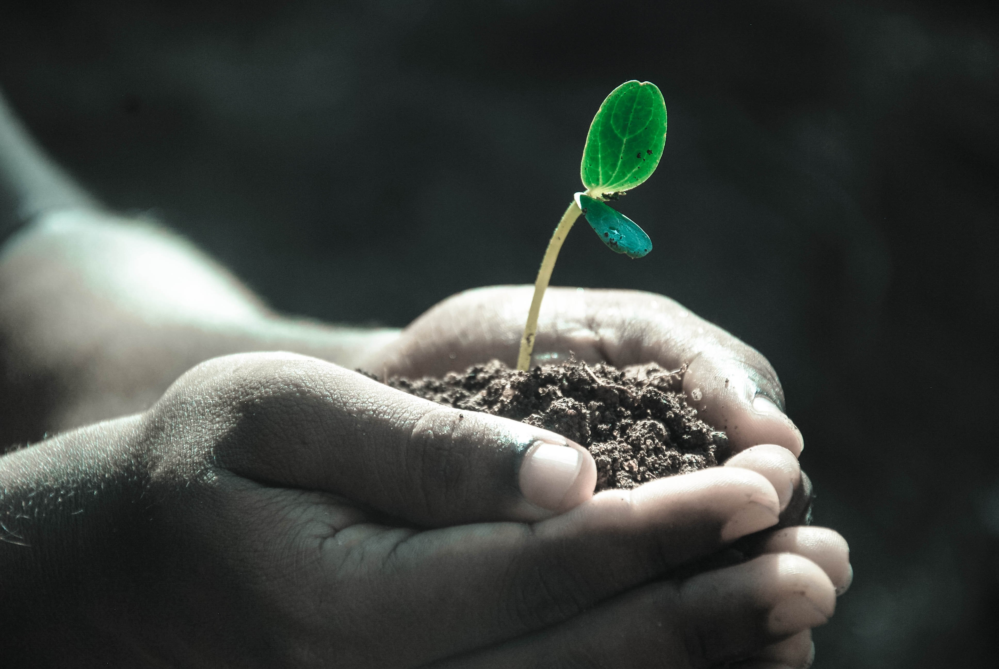
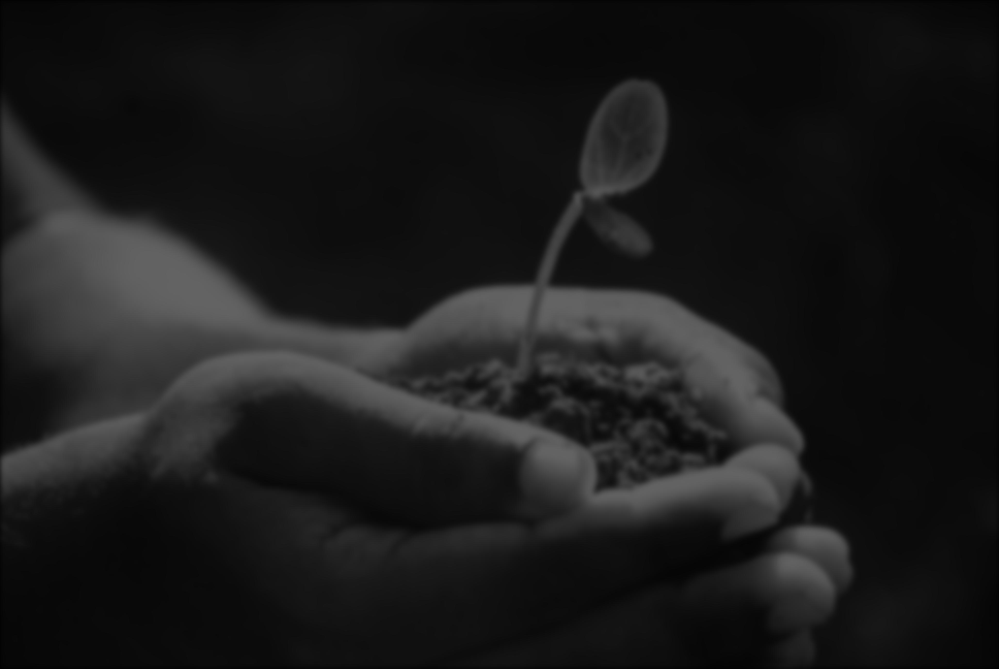
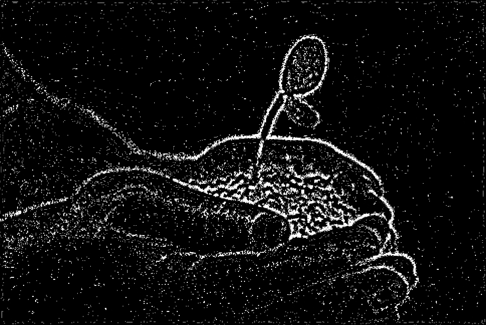

# Realtime Video Stitching using Scale Invariant Feature Transform

<h2>Description</h2>
<p align="justify">This project aims to stitch the video outputs from two camera sensor into one complete video. The process involves, extracting features points from each frame of the video, matching keypoints with the images, generate a homography matrix and stitching and warping the images. </p>
<h2>Installation</h2>

```
git clone https://github.com/AugustinJose1221/Internship.git
pip install -r requirements.txt
```
To run the program,

```
python main.py
```

Change the video files in the Video directory to test it on custom video files

<h2>Working</h2>
<br>
<h3>Input Image</h3>


```
The input image is loaded using opencv functions. All operations on the image is done as a numpy array.
```

<br>
<h3>Grayscale image</h3>


```
The image is converted to grayscale. By doing so, the details get more prominent and the number of 
channels of the image gets reduced from 3 to 1. This also increases the processing time of the program
```

<br>
<h3>Gaussian Blur</h3>
<table>
  <tr>
    <td>sigma=11</td>
    <td>sigma=12</td>
  </tr>
  <tr>
    <td></td>
    <td></td>
  </tr>
 </table>
 <br>
<h3>Difference of Gaussian</h3>
</img>
